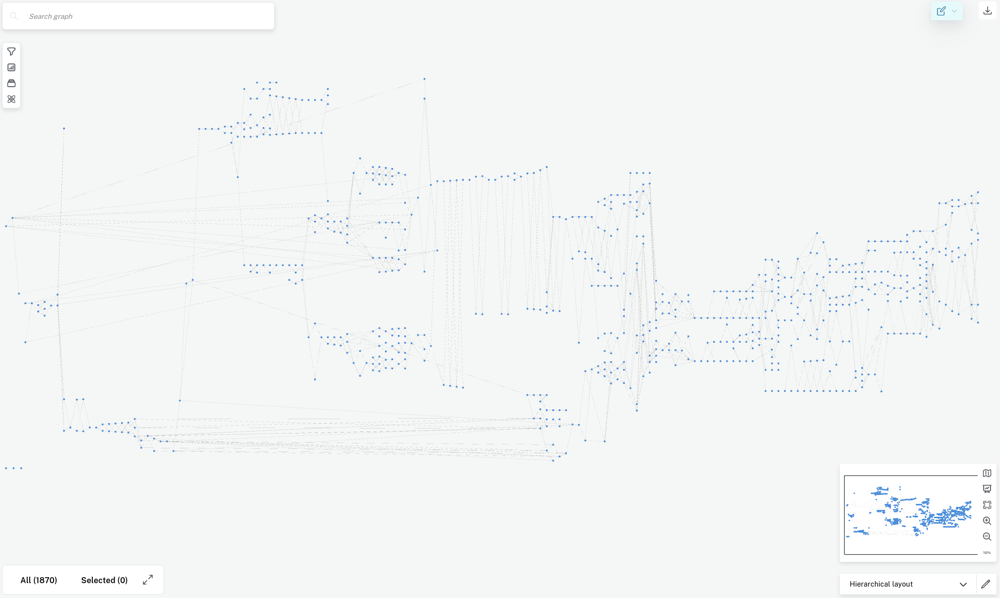
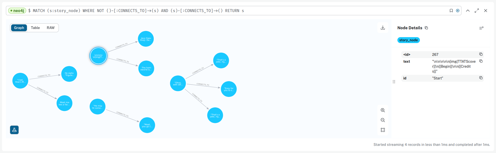
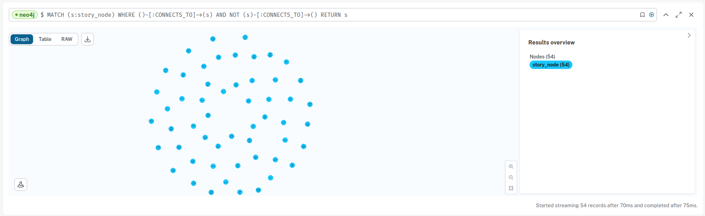
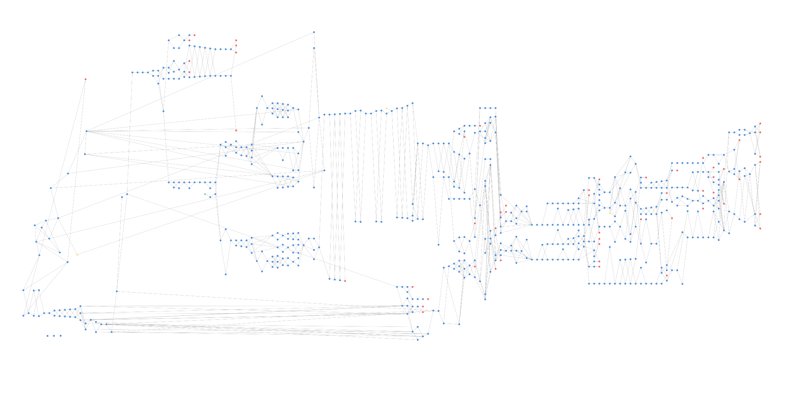
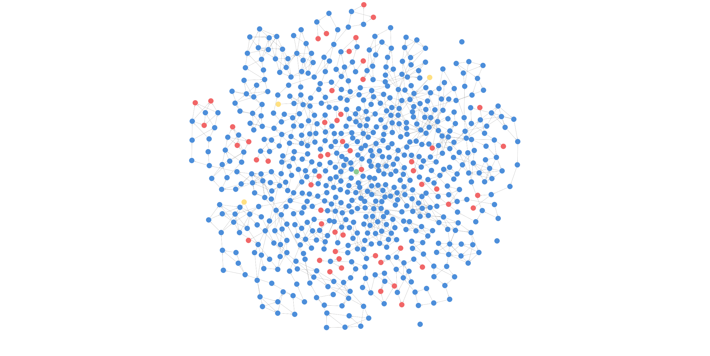
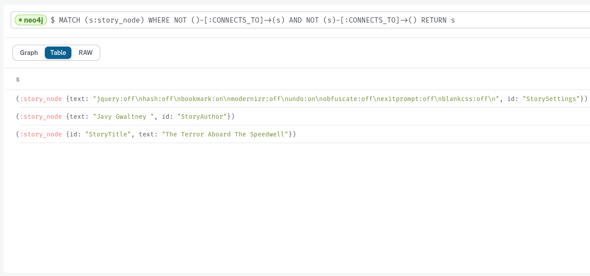
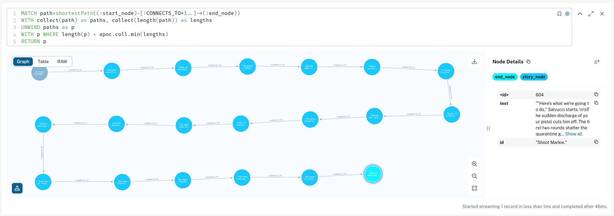

= A text-based adventure in Neo4j

:Author:    Richard Sill
:Email:     <rschroed2009@gmx.de>
:Date:       21.10.2023
:Revision:  1.0

== About the project

I drew inspiration from link:https://neo4j.com/blog/vampire-express-graph-database-choose-your-own-adventure/[Vampire Express: Graphing a Classic ’80s Choose Your Own Adventure Story] by Joe Depeau, one of the suggestions included in _Technical Writing challenge 1.4 - Google Docs.pdf_.

I first discovered _Choose Your Own Adventures_ when I was a teenager.
At the time I had a physical copy, a booklet that related thematically to a tabletop role-playing game.
It had me look up pages to proceed with the story and I really liked the unique way of interacting with the text, rather than just consuming the content.

Graph-based models of _Choose Your Own Adventures_ are well explored.
For example, some interesting aspects of such graph representations are covered in link:https://www.atlasobscura.com/articles/cyoa-choose-your-own-adventure-maps[These Maps Reveal the Hidden Structures of 'Choose Your Own Adventure' Books] by Sarah Laskow.

Unfortunately, I no longer had the booklet from 20 years ago (and I think it was in German language) nor any other _Choose Your Own Adventure_ books at the ready.
Instead, I went online and looked for a suitable digital model.

== The data model

=== Getting hold of usable source data

I always loved link:https://www.imdb.com/title/tt0078748/?ref_=nv_sr_srsg_1_tt_7_nm_0_q_alien[Alien], so that was my go-to search term alongside _Choose Your Own Advenutre_.

I found the article link:https://www.polygon.com/2014/9/8/6123049/alien-aliens-avp-terror-aboard-the-speedwell[The best Alien game is a text adventure] by Danielle Riendeau which highly praises the adventure _The Terror Aboard the Speedwell_, written by Javy Gwaltney.
A free and playable version can be found link:https://jgwaltneiv.itch.io/the-terror-aboard-the-speedwell[here].

.To download the game:
. Click *Download*.
. In the overlay, click *No thanks, just take me to the downloads* above the donation input.
. For the HTML-based version, *Download* _The Terror Aboard The Speedwell 1.2.zip_ and unzip it.

Luckily, the HTML-based version contains the entire adventure as a set of +div+ elements which are sufficiently readable and more importantly easy to process.

=== Extracting the data

The +div+ elements with the story snippets inside _The Terror Aboard The Speedwell 1.2.html_ look like this:

[source,html]
----

The homeworld is nothing like you thought it would be. The landscape is black as tar and the temperature readings make you thankful for the air conditioning in your suit.

The crater, the reason for your journey, is dead ahead, a half mile in the distance. You don't mind the trek; this is a far cry from the 35 million miles you and your crew had to traverse for two months.

What a long way you’ve come, you muse. But what is an ending but the beginning of another journey, wrote…who wrote that? You wrack your brain for an answer. The answer is just outside the limits of your consciousness, floating. You reach for it, grasp its tail, and then—

Sergeant Ryan Benson turns around to look at you.

1.[[“Julia,” he says.]]
2.[[“Zoe,” he says.]]

----

[source,html]
----

“Julia, everything okay? You’ve got that look in your eyes.”

Ryan constantly feels some need to ask if you’re all right. Either out of attraction or platonic concern, you’re not sure which. However, you are certain that it bugs the snot out of you.

1.[[&quot;Yes, I’m fine.&quot;]]
2.[[&quot;Yes, Ryan, I’m fine.&quot;]]
3.[[&quot;I’m fine.&quot;]]

----

Note that occurrences of `\n` have been replaced with a carriage return in the listings above.

.Observations:
. The +tiddler+-attribute of a +div+ element represents the user's choice in the previous step in the story. It also serves as a unique identifier among the elements.
. Outgoing connections are typically enumerated as a list of links, embedded in double square brackets, but may occasionally also be found earlier throughout the text.

I wrote a link:divparser.py[Python script] to parse the +div+ elements and to create two CSV files, link:nodes.csv[nodes.csv] and link:edges.csv[edges.csv].
I chose the CSV file format because Neo4j allows the upload of CSV files into its data model.

._nodes.csv_:
[source,csv]
----
incoming,text
...
"Begin","The homeworld is nothing like you thought it would be. The landscape is black as tar and the temperature readings make you thankful for the air conditioning in your suit.\n\nThe crater, the reason for your journey, is dead ahead, a half mile in the distance. You don't mind the trek; this is a far cry from the 35 million miles you and your crew had to traverse for two months.\n\nWhat a long way you've come, you muse. But what is an ending but the beginning of another journey, wrote...who wrote that? You wrack your brain for an answer. The answer is just outside the limits of your consciousness, floating. You reach for it, grasp its tail, and then—\n\nSergeant Ryan Benson turns around to look at you.\n\n1.[[""Julia,"" he says.]]\n2.[[""Zoe,"" he says.]]\n\n"
...
"""Julia,"" he says.","""Julia, everything okay? You've got that look in your eyes.""\n\nRyan constantly feels some need to ask if you're all right. Either out of attraction or platonic concern, you're not sure which. However, you are certain that it bugs the snot out of you.\n\n1.[[""Yes, I'm fine.""]]\n2.[[""Yes, Ryan, I'm fine.""]]\n3.[[""I'm fine.""]]\n"
...
----

I treat the *incoming* column as the node's ID. The only other column is *text* to store the actual story snippet with the node.

._edges.csv_:
[source,csv]
----
from,to
...
"Begin","""Julia,"" he says."
...
----

Each edge is represented by the tuple made up of the IDs of the source and target nodes.

=== Populating the Neo4j graph

First, I loaded up the two files _nodes.csv_ and _edges.csv_ this GitHub repository (link:https://github.com/GWHaluan/neo4j[https://github.com/GWHaluan/neo4j]) and then to Neo4j via the `LOAD CSV` link:https://neo4j.com/docs/cypher-manual/current/clauses/load-csv/[Cypher command], based on the queries explained in link:https://neo4j.com/docs/cypher-manual/current/clauses/load-csv/[LOAD CSV command with Cypher].

.Cypher query for _nodes.csv_:
[source]
----
LOAD CSV WITH HEADERS FROM "https://raw.githubusercontent.com/GWHaluan/neo4j/main/nodes.csv" AS row
MERGE (c:story_node {id: row.incoming, text: row.text});
----

Note that I call values from the *incoming* column `id` in the Neo4j data model.

.Cypher query for _edges.csv_:
[source]
----
LOAD CSV WITH HEADERS FROM "https://raw.githubusercontent.com/GWHaluan/neo4j/main/edges.csv" AS row
MATCH (e:story_node {id: row.from})
MATCH (c:story_node {id: row.to})
MERGE (e)-[rel1:CONNECTS_TO]->(c) ON CREATE SET rel1.choice = row.to;
----

Each `CONNECTS_TO`-edge gets a label `choice` with the ID of the node associated with the *to* column.

[comment]
--

delete commands:

[source]
----
MATCH ()-[r:CONNECTS_TO]->()
DELETE r
----

[source]
----
MATCH (n:story_node)
DELETE n
----
--

With that, and the use of the hierarchical layout in Neo4j Workspace, the graph looks like this:

=== Labeling start and end nodes

The graph is still missing the important detail of start and end nodes.
Rather than looking them up manually, I tried the following Cypher queries to detect them.

.Cypher query for start nodes:
[source]
----
MATCH (s:story_node)
WHERE NOT ()-[:CONNECTS_TO]->(s)
AND (s)-[:CONNECTS_TO]->()
RETURN s
----

The query yielded an unexpected result:

There are four start nodes, three of which are not actually start nodes.
No +div+ element connects to the corresponding three elements in _The Terror Aboard The Speedwell 1.2.html_.
The real start node is selected in the image.

I added the `start_node` label to that node with the following Cypher query:

[source]
----
MATCH (s:story_node {id: 'Start'})
SET s:start_node
RETURN s
----

Afterwards, I added the `fake_start_node` label to the other three nodes with the following Cypher query:

[source]
----
MATCH (s:story_node)
WHERE NOT ()-[:CONNECTS_TO]->(s)
AND NOT (s:start_node)
AND (s)-[:CONNECTS_TO]->()
SET s:fake_start_node
RETURN s
----

Finally, only the labels for end nodes are missing.

.Cypher query for end nodes nodes:
[source]
----
MATCH (s:story_node)
WHERE ()-[:CONNECTS_TO]->(s)
AND NOT (s)-[:CONNECTS_TO]->()
RETURN s
----

The image reveals that there is a total of 54 end nodes.
I double-checked the `text` properties of the nodes and they all contain a "The End" towards the end.

.Cypher query to add the `end_node` label:
[source]
----
MATCH (s:story_node)
WHERE ()-[:CONNECTS_TO]->(s)
AND NOT (s)-[:CONNECTS_TO]->()
SET s:end_node
RETURN s
----

With start nodes, fake start nodes and end nodes highlighted in green, yellow and red, the graph looks like this:

The force-based layout is a little compacter:

== Querying the adventure graph

=== Q: Are there unreachable story nodes?

A quick glance at the complete graph in link:#populating-the-neo4j-graph[] reveals three nodes that are not connected to the rest of the graph.
The following Cypher query lists the exact three nodes:

[source]
----
MATCH (s:story_node)
WHERE NOT ()-[:CONNECTS_TO]->(s)
AND NOT (s)-[:CONNECTS_TO]->()
RETURN s
----

The image below reveals that these nodes hold information about the author, the title and the game settings:

Apparently they were encoded as +div+ elements like the actual story nodes.

=== Q: What's the quickest way to beat the story? What's the longest route?

.Cypher query to find the shortest path or paths:
[source]
----
MATCH path=shortestPath((:start_node)-[:CONNECTS_TO*1..]->(:end_node))
WITH collect(path) as paths, collect(length(path)) as lengths
UNWIND paths as p
WITH p WHERE length(p) = apoc.coll.min(lengths)
RETURN p
----

It query yields a single result with a length of 20 (start node, 18 story nodes, end node):

.Cypher query to find the longest path or paths:
[source]
----
MATCH path=shortestPath((:start_node)-[:CONNECTS_TO*1..]->(:end_node))
WITH collect(path) as paths, collect(length(path)) as lengths
UNWIND paths as p
WITH p WHERE length(p) = apoc.coll.max(lengths)
RETURN p
----

The reverse query with the `max` length instead of `min` length yields six results with a length of 100 (start node, 98 story nodes and one of the six end nodes):

image::images/path_longest[Longest paths]

Note that I had to add `shortestPath` to avoid the circles in the graph.
The queries are based on a similar query by Joe Depeau.

=== Q: Is there a path from the fake start nodes to end nodes?

.Cypher query to find paths from fake start nodes to end nodes:
[source]
----
MATCH path=shortestPath((:fake_start_node)-[:CONNECTS_TO*1..]->(:end_node))
RETURN path
----

I downloaded the link:neo4j_query_table_paths_from_fake_start_nodes.csv[CSV file] for the query and included it in the repository.
It reveals that there are 106 different paths from fake start nodes to end nodes.

== Challenges

This section contains some notes on the execution of the project and what difficulties i faced while doing it.

Nonetheless, I'd like to make clear that the project has been incredibly fun 🧑‍💻

=== Which Neo4j environment to use?

Once I had a proof of concept data set in CSV format, I tried to access Neo4j.

First, I tried registering two of my email addresses for both link:https://neo4j.com/sandbox/[Neo4j Sandbox] and link:https://neo4j.com/cloud/platform/aura-graph-database/[Neo4j Aura DB].
For some reason, I never received a confirmation email. ⛔

Next, I downloaded link:https://neo4j.com/download/[Neo4j Desktop].
Loading the CSV files into the application posed a problem - apparently my system lacked the correct Java version (or, for starters, any Java version).
I installed the suggestion version (Oracle Java SDK 17), yet the same error message occurred. ⛔

Back to Neo4j Sandbox, I noticed that I could select *Continue with LinkedIn*.
This worked fine, and the environment I used for the remainder of the project was Neo4j Sandbox, with a blank sandbox and opened with Workspace. ✅

=== From proof of concept to Python script and valid CSV files

While the proof of concept was implemented quickly, the actual realization of the project surpassed my expectations in terms of effort.

Especially a set of special characters that were used inconsistently throughout the source HTML file required several debugging and refining steps before I ended up with a usable set of CSV files that I could upload.

Fun fact: link:edges.csv[edges.csv] contains 1148 lines, however upon import, Neo4j apparently created 1172 relationships. I'm still not sure why exactly:

image::images/edges_import.png[Edges import]

=== Circles in the graph

I would have liked to include something substantial about circles in the graph.
Everything I've tried failed because the procedures were running for a very long time.
I suspect this is due to the relatively large graph size and the fact that there are a lot of circles.
